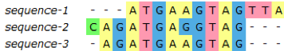

*Today’s exercises will show how you can use DNA sequences for taxonomic classification.*

Fasta files are text files used for nucleic acids and aminoacids. Sequences in Fasta start with a `>` symbol followed by a description (i.e., header). The next line contains the sequence itself. The following is an example of a DNA fasta file

```{r, echo=FALSE}
# install.packages("ape")
# install.packages("phangorn")
# install.packages("seqinr")
# if (!requireNamespace("BiocManager", quietly=TRUE)){
#   install.packages("BiocManager")
# }
# BiocManager::install("msa")
library(msa)
library(ape)
library(phangorn)
library(seqinr)
```

```{r, echo=FALSE}
manSequenceFile <- "../manual/MAR105_manual.fasta"
manSequences <- readDNAStringSet(manSequenceFile)
manSequences
```

To be able to compare these sequences we first need to $\underline{align}$ them.



Once the sequences have been aligned we can look for mutations, conserved regions, variable regions, among other. We can also use these sequences for taxonomic classification. Particularly, the cytochrome b gene is useful when looking for the identity of metazoans. Other genes can also be used.

Today, we will use [Rstudio](https://rstudio.com/){target="_blank"} to do alignments and trees of cytochrome b sequences.

$\underline{The\space exercise\space starts\space here}$

1. **Go to GUL. Inside the folder `data`, download following FASTA file: `MAR105_sequence.fasta`**  

1. **Open the program Notepad, in Swedish "Anteckningar"**

1. **Open the fasta file and look inside**

We could work directly on the fasta files. However today we will use [BLAST](https://blast.ncbi.nlm.nih.gov/Blast.cgi){target="_blank"} and [Rstudio](https://rstudio.com/){target="_blank"} for making a gene alignment and a phylogenetic tree. Remember this just one way of doing this. There are other programs and web tools that can be used.

## BLAST

We will now use the [BLAST service](https://blast.ncbi.nlm.nih.gov/Blast.cgi){target="_blank"} at the NCBI website. BLAST will compare the sequence you are interested into, against a database with many sequences and show you the most similar results (homologus sequences). This is useful when trying to figure out which organisms you have sequenced. We will use the nucleotide-nucleotide BLAST (blastn) program. This program compares DNA sequences against a specific DNA database.

4. **From Notepad, in Swedish "Anteckningar", copy the first sequence and paste it in `blastn` where it says `Enter accession number(s), gi(s), or FASTA sequence(s)`**

5. **Copy and paste the header of the first sequence in `blastn` where it says `Job Title`**

6. **In the `Database` option, select `Standard databases`**

7. **In `Program Selection`, select `Highly similar sequences (megablast)`**

8. **Expand `Algorithm parameters`**

9. **In `General Parameters`, select 10 for `Max target sequences`**

10. **Click BLAST below**

BLAST will return now a table showing similar sequences to your submission. **What is top alignment?**

The results are organized by `E-value`. This indicates how likely the alignment could be the result of chance. Values closer to 0 are more “significant”; while 1 could be just chance. The `Per. Ident` is the percentage matches between your sequence and the hit. A common definition of species is that they share at least 97% identity in the cytochrome b gene. **Did you get any hit with 97% or more identity?**

If you do click on the Description title from one of the hits, you can see the alignment between your sequence and the one from the database.

11. **Go back to `Descriptions`and click on the `Accession` of the top hit**

A page with more information about the hit will open. There is useful information there. You can see who sequenced it. On which paper was the sequence originally used. Often there is also taxonomic information there.

12. **Click on `FASTA` (top-left corner)**

13. **Copy the header and the sequence, paste it into the sequence.fasta file `MAR105_sequence.fasta` and save it**

14. **Repeat the BLAST steps for the other two sequences**

15. **Save!**

## Multiple sequence alignment

16. **Open Rstudio and create a new file `Rscript`**

17. **Install and load the following R packages**

```{r, eval=FALSE}
install.packages("ape")
install.packages("phangorn")
install.packages("seqinr")
if (!requireNamespace("BiocManager", quietly=TRUE)){
  install.packages("BiocManager")
}
BiocManager::install("msa")
library(msa)
library(ape)
library(phangorn)
library(seqinr)
```

18. **Read the FASTA file into R** (it should contain 6 sequences in total)

```{r, eval=FALSE}
mySequenceFile <- "../data/MAR105_sequence.fasta"
mySequences <- readDNAStringSet(mySequenceFile)
mySequences
```

19. **Do the alignment**

```{r, eval=FALSE}
myFirstAlignment <- msa(mySequences)
myFirstAlignment
```

20. **You can change how it is printed on the screen or save it as PDF**

```{r, eval=FALSE}
print(myFirstAlignment, show="complete")

msaPrettyPrint(myFirstAlignment, output="pdf", showNames="none",
               showLogo="none", askForOverwrite=FALSE, verbose=FALSE)

msaPrettyPrint(myFirstAlignment, y=c(164, 213), output="asis",
               showNames="none", showLogo="none", askForOverwrite=FALSE)
```

21. **Other alignment algorithms are available**

```{r, eval=FALSE}
myClustalWAlignment <- msa(mySequences, "ClustalW")
myClustalWAlignment
myClustalOmegaAlignment <- msa(mySequences, "ClustalOmega")
myClustalOmegaAlignment
myMuscleAlignment <- msa(mySequences, "Muscle")
myMuscleAlignment
```

## Tree

Now we will make a simple phylogenic tree. A phylogenic tree is a representation of the evolutionary relationships of several organisms.


22. **Convert Clustal W alignment object**
```{r, eval=FALSE}
dna_phy = msaConvert(myClustalWAlignment, "phangorn::phyDat")
```

23. **Compare different nucleotide substitution models**

```{r, eval=FALSE}
mt <- modelTest(dna_phy)
print(mt)
```

The best model is the one with the lowest Bayesian Information Criterion (BIC):

```{r, eval=FALSE}
(best_mod = mt$Model[order(mt$BIC, decreasing = FALSE)[1]])
```

24. **Compute pairwise distances from aligned sequences**

There are only two substitution models for nucleotide sequences, JC69 or F81. Give it a try to see whether a different model produces a different tree. Simply, change the model argument in the code below.

```{r, eval=FALSE}
dna_dist <- dist.ml(dna_phy, model="F81")
```

25. **Build and plot two different phylogenetic trees**

```{r, eval=FALSE}
my_UPGMA <- upgma(dna_dist)
my_NJ  <- NJ(dna_dist)
plot(my_UPGMA, main="UPGMA")
plot(my_NJ, main = "Neighbor Joining")
```

## If you finish early

What happen if we add to the tree an organism which is not closely related?

Distantly related orgnisms should appear clearly distinct in the phylogenetic tree. A sequence outside the group of interest is called an outgroup.

# THE END!

\newpage

# References

**Phylogenetic trees**

[Baum, D. (2008) Reading a phylogenetic tree: The meaning of monophyletic groups. Nature Education 1(1):190](https://www.nature.com/scitable/topicpage/reading-a-phylogenetic-tree-the-meaning-of-41956/){target="_blank"}

**BLAST**

* [There are some videos about Blast in YouTube in the NCBI channel. Especially useful to understand Blast results](https://www.youtube.com/watch?v=nO0wJgZRZJs&feature=youtu.be){target="_blank"}

* [An introduction about the BLAST website interface](ftp://ftp.ncbi.nlm.nih.gov/pub/factsheets/HowTo_BLASTGuide.pdf)

* [An explanation of the BLAST results](ftp://ftp.ncbi.nlm.nih.gov/pub/factsheets/HowTo_NewBLAST.pdf)

* If you want to know how the BLAST algorithm works:
[Lobo, I. (2008) Basic Local Alignment Search Tool (BLAST). Nature Education 1(1):215](https://www.nature.com/scitable/topicpage/basic-local-alignment-search-tool-blast-29096/){target="_blank"}